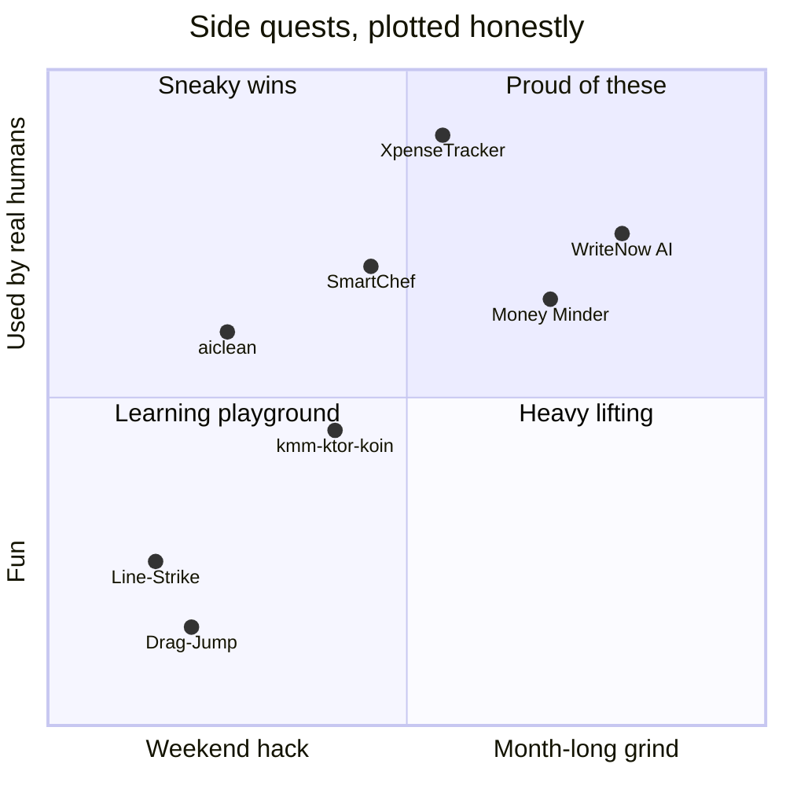
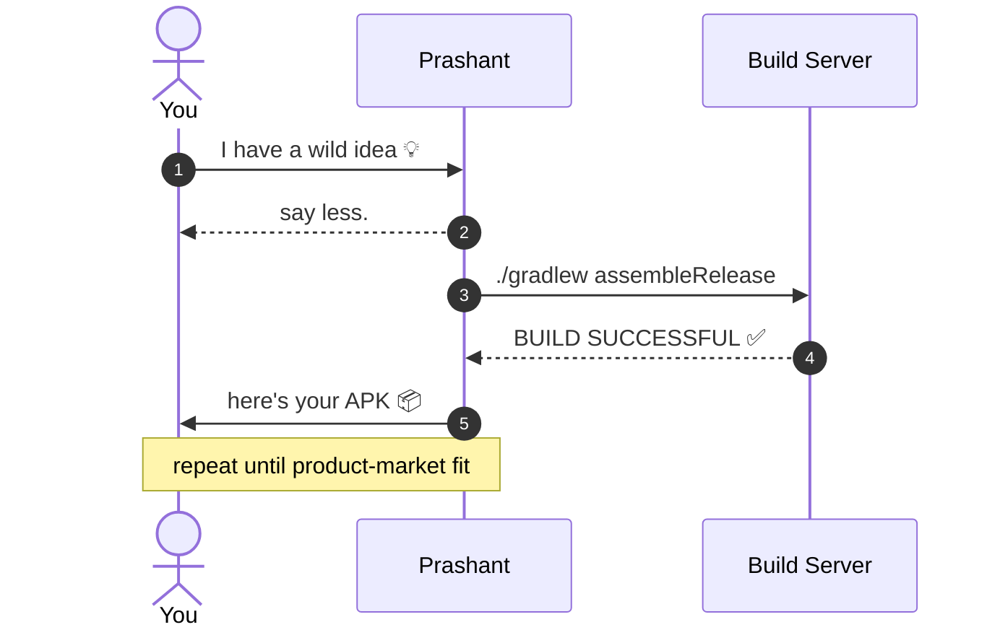

<!--
  ┌──────────────────────────────────────────────────────────────┐
  │  you opened the source. respect. 🫡                           │
  │  this profile is rendered with GitHub-native blocks only:    │
  │  mermaid · latex · diff · alerts · actions-powered game │
  └──────────────────────────────────────────────────────────────┘
-->

<div align="center">

```
██████╗ ██████╗  █████╗ ███████╗██╗  ██╗ █████╗ ███╗   ██╗████████╗
██╔══██╗██╔══██╗██╔══██╗██╔════╝██║  ██║██╔══██╗████╗  ██║╚══██╔══╝
██████╔╝██████╔╝███████║███████╗███████║███████║██╔██╗ ██║   ██║
██╔═══╝ ██╔══██╗██╔══██║╚════██║██╔══██║██╔══██║██║╚██╗██║   ██║
██║     ██║  ██║██║  ██║███████║██║  ██║██║  ██║██║ ╚████║   ██║
╚═╝     ╚═╝  ╚═╝╚═╝  ╚═╝╚══════╝╚═╝  ╚═╝╚═╝  ╚═╝╚═╝  ╚═══╝   ╚═╝
```


<kbd>ANDROID</kbd> <kbd>KOTLIN</kbd> <kbd>KMM</kbd> <kbd>JETPACK&nbsp;COMPOSE</kbd> <kbd>NODE</kbd> <kbd>NEXT.JS</kbd> <kbd>AWS</kbd> <kbd>LLM&nbsp;APPS</kbd>

<sub>⌘ press any key to continue — or just scroll</sub>

</div>

---

```text
prashant@bangalore:~$ neofetch
        ▄▄▄▄▄▄▄         prashant@github
      ▄█▀     ▀█▄       ─────────────────────────
     █▀  ●   ●  ▀█      OS        Human 1.0 (caffeinated)
     █           █      Host      FloBiz · SDE-II
     █  ▀▄▄▄▄▄▀  █      Kernel    Kotlin / JVM
      ▀█▄     ▄█▀       Uptime    since 2016-08-20
        ▀▀▀▀▀▀▀         Shell     zsh + claude code
      ▄█ █   █ █▄       Prev      Internshala
     ▀▀  ▀   ▀  ▀▀      Mentor    hackCBS 2.0
                        Locale    Bangalore, IN 🇮🇳
                        Packages  13 public repos · 146★ on XpenseTracker
```

> [!NOTE]
> This profile is **playable**. Scroll to `play.sh` and beat my bot at tic‑tac‑toe — a GitHub Action referees every move and writes it back here.

---

## `$ cat equation.tex`

```math
\text{Impact} \;=\; \int_{2016}^{\infty} \frac{\text{curiosity}(t)\cdot \text{shipping}(t)}{\text{meetings}(t) + \varepsilon}\,dt \;\;\xrightarrow{\;t\to\infty\;}\;\; \infty
```

## `$ git log --graph --career`

<p align="center"></p>

## `$ ./projects --plot impact effort`



## `$ ls ~/featured`

| | Project | What it does | Built with |
|:-:|---|---|---|
| 🧹 | [**aiclean**](https://github.com/Prashant-123/aiclean) | Reclaim disk from 50+ AI & dev tools. One command, risk-aware. | `JavaScript` `CLI` |
| 💸 | [**XpenseTracker**](https://github.com/Prashant-123/XpenseTracker) | Smart expense manager — **146★** | `Java` `Android` |
| ✨ | [**WriteNow**](https://writenow.in) | AI-crafted, ATS-friendly resumes + one-click social scheduling | `Next.js` `Node` `Puppeteer` `OpenAI` `AWS` |
| 📊 | [**Money Minder**](https://moneyminder.in) | Multi-currency tracking, monthly reports, PDF export | `Compose` `Express` `AWS` |
| 🍱 | **SmartChef** | Cook by ingredients — 2.5k+ users | `Android` |
| 🧬 | [**kmm-ktor-koin**](https://github.com/Prashant-123/kmm-ktor-koin) | Kotlin Multiplatform starter: Ktor + Koin | `Kotlin` `KMM` |

## `$ diff me@2016 me@now`

```diff
- println("Hello World")
+ suspend fun ship(idea: Idea) = coroutineScope { build(idea).test().release() }

- Unity side projects for fun
+ Android apps used by millions of small businesses @ FloBiz

- "what is an API?"
+ Kotlin · KMM · Node · Next.js · AWS · LLM agents

- asking seniors for help
+ mentoring hackers @ hackCBS 2.0
```

## `$ man prashant`

<details>
<summary><b>NAME</b></summary>

&nbsp;&nbsp;&nbsp;&nbsp;**prashant** — turns coffee into Kotlin, and ideas into shipped apps.

</details>

<details>
<summary><b>SYNOPSIS</b></summary>

```sh
prashant [--android] [--kmm] [--backend] [--ai] [--freelance] <idea>
```

</details>

<details>
<summary><b>OPTIONS</b></summary>

| Flag | Meaning |
|---|---|
| `--android` | Native Android · Jetpack Compose · Kotlin coroutines |
| `--kmm` | Shared business logic across Android & iOS |
| `--backend` | Node · Express · Firebase · MongoDB · AWS |
| `--ai` | LLM-powered products, agents, automation |
| `--freelance` | Yes. [Ping me.](https://pklabs.in) |

</details>

<details>
<summary><b>BUGS</b></summary>

&nbsp;&nbsp;&nbsp;&nbsp;Occasionally refactors things that already work. Known issue. Won't fix.

</details>

<details>
<summary><b>SEE ALSO</b></summary>

&nbsp;&nbsp;&nbsp;&nbsp;[pklabs.in(1)](https://pklabs.in) · [medium(7)](https://medium.com/@dev-prashant) · [linkedin(8)](https://www.linkedin.com/in/dev-prashant/)

</details>

## `$ ./play.sh --vs bot`

> [!TIP]
> Click any square → hit **Create** on the issue that opens → a GitHub Action plays the bot's reply, redraws this board, and pings you back. Win and your name lands in the hall of fame.

<!--TTT:START-->
<div align="center">

<table>
<tr><td></td><td><a href="https://github.com/Prashant-123/Prashant-123/issues/new?title=ttt%7Cmove%7C1&body=Just%20hit%20**Create**%20%F0%9F%91%87%20%E2%80%94%20the%20bot%20replies%20in%20~30s%20and%20updates%20the%20profile.%0A%0A_Play%20B1_"></a></td><td><a href="https://github.com/Prashant-123/Prashant-123/issues/new?title=ttt%7Cmove%7C2&body=Just%20hit%20**Create**%20%F0%9F%91%87%20%E2%80%94%20the%20bot%20replies%20in%20~30s%20and%20updates%20the%20profile.%0A%0A_Play%20C1_"></a></td></tr>
<tr><td><a href="https://github.com/Prashant-123/Prashant-123/issues/new?title=ttt%7Cmove%7C3&body=Just%20hit%20**Create**%20%F0%9F%91%87%20%E2%80%94%20the%20bot%20replies%20in%20~30s%20and%20updates%20the%20profile.%0A%0A_Play%20A2_"></a></td><td></td><td><a href="https://github.com/Prashant-123/Prashant-123/issues/new?title=ttt%7Cmove%7C5&body=Just%20hit%20**Create**%20%F0%9F%91%87%20%E2%80%94%20the%20bot%20replies%20in%20~30s%20and%20updates%20the%20profile.%0A%0A_Play%20C2_"></a></td></tr>
<tr><td><a href="https://github.com/Prashant-123/Prashant-123/issues/new?title=ttt%7Cmove%7C6&body=Just%20hit%20**Create**%20%F0%9F%91%87%20%E2%80%94%20the%20bot%20replies%20in%20~30s%20and%20updates%20the%20profile.%0A%0A_Play%20A3_"></a></td><td><a href="https://github.com/Prashant-123/Prashant-123/issues/new?title=ttt%7Cmove%7C7&body=Just%20hit%20**Create**%20%F0%9F%91%87%20%E2%80%94%20the%20bot%20replies%20in%20~30s%20and%20updates%20the%20profile.%0A%0A_Play%20B3_"></a></td><td><a href="https://github.com/Prashant-123/Prashant-123/issues/new?title=ttt%7Cmove%7C8&body=Just%20hit%20**Create**%20%F0%9F%91%87%20%E2%80%94%20the%20bot%20replies%20in%20~30s%20and%20updates%20the%20profile.%0A%0A_Play%20C3_"></a></td></tr>
</table>

🟢 **Your turn** — you are <kbd>X</kbd>, click any empty square

| 👤 Humans | 🤖 Bot | 🤝 Draws |
|:-:|:-:|:-:|
| **0** | **0** | **0** |

**Hall of fame** &nbsp; _nobody yet — be the first_

<sub>last moves: [@Prashant-123](https://github.com/Prashant-123) → B2</sub>

</div>
<!--TTT:END-->

## `$ mermaid --who-talks-to-whom`



## `$ curl -X POST prashant/connect`

<div align="center">

[](https://pklabs.in)
[](https://www.linkedin.com/in/dev-prashant/)
[](https://medium.com/@dev-prashant)
[](https://x.com/pkm021998)
[](https://drive.google.com/file/d/1jSpvLyLf4881LQx1N5XgoQjIuQZy45iy/view?usp=sharing)


<sub><code>exit 0</code> — ⭐ a repo on your way out, it compiles my happiness.</sub>

</div>
